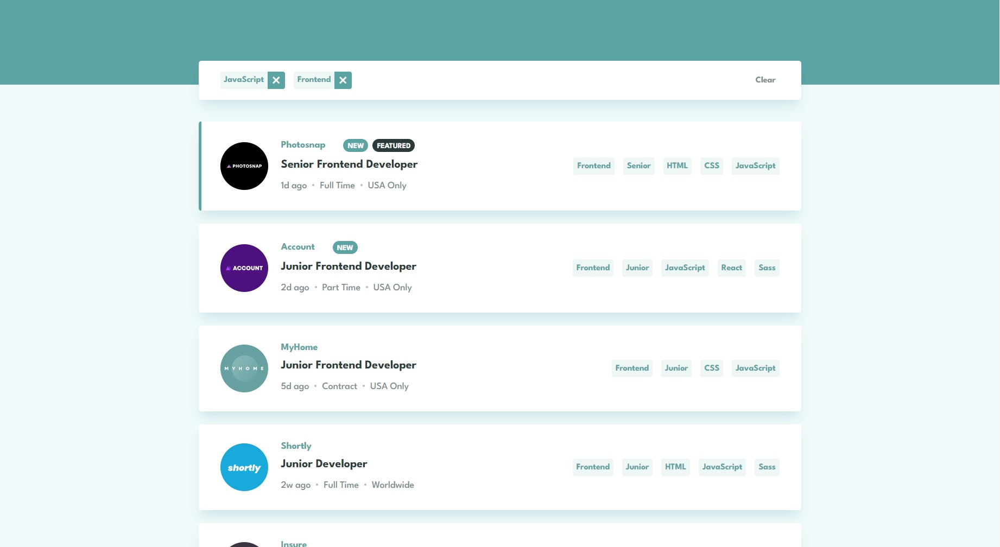

# Frontend Mentor - Job listings with filtering solution

This is a solution to the [Job listings with filtering challenge on Frontend Mentor](https://www.frontendmentor.io/challenges/job-listings-with-filtering-ivstIPCt). Frontend Mentor challenges help you improve your coding skills by building realistic projects. 

## Table of contents

- [Overview](#overview)
  - [The challenge](#the-challenge)
  - [Screenshot](#screenshot)
  - [Links](#links)
- [My process](#my-process)
  - [Built with](#built-with)
  - [What I learned](#what-i-learned)
  - [Continued development](#continued-development)
- [Author](#author)

## Overview

### The challenge

Users should be able to:

- View the optimal layout for the site depending on their device's screen size
- See hover states for all interactive elements on the page
- Filter job listings based on the categories

### Screenshot

### Links

- Solution URL: [frontendmentor.io](https://www.frontendmentor.io/solutions/job-listings-with-filtering-using-react-context-hook-and-stitches-Yc4vUTA7in)
- Live Site URL: [Github pages](https://daniil034.github.io/Job-listings-with-filtering/)

## My process

### Built with

- Semantic HTML5 markup
- Flexbox
- Mobile-first workflow
- [React](https://reactjs.org/) - JS library
- [Stitches](https://stitches.dev/) - CSS-in-JS library with near-zero runtime 

### What I learned

I learned basics of Stitches and how it can improve my experience of styling React components, though at first it was a pain in a ... to settle it in this project.
I was also able to implement React hook createContext which is quite handy for such small projects over Redux.

### Continued development

I think I will continue poring over this Stitches library and hope to improve my knowledge to decent level.

### Useful resources

- [Vite Static Asset Handling](https://vitejs.dev/guide/assets.html) - This helped me to settle the issue of handling relative paths.

## Author

- Frontend Mentor - [@Daniil034](https://www.frontendmentor.io/profile/Daniil034)
